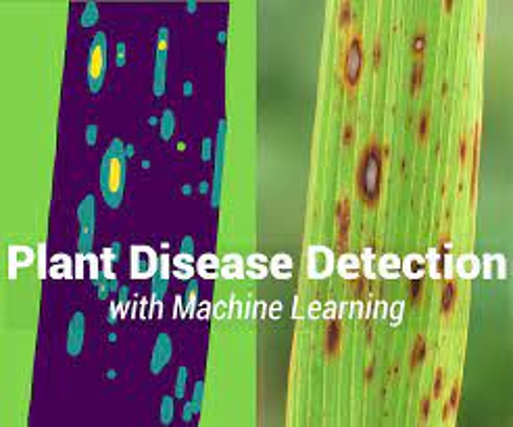

# Plant Disease Detection using Machine Learning

## Overview

Plant diseases are a significant challenge in agriculture, leading to billions of dollars in losses annually. Traditional methods of disease detection, such as visual inspection by experts, are time-consuming and prone to human error. This project leverages machine learning to automate the detection of plant diseases, providing farmers with a faster and more accurate solution to identify and manage diseases in crops.

## Features

- **Automated Disease Detection**: Detect diseases in plants using machine learning models trained on image datasets.
- **Crop Recomendation**: Analyzes soil, climate, and historical data to suggest the most suitable crops for your region.
- **High Accuracy**: Our model achieves high accuracy in identifying various plant diseases and soil recomendation, reducing the need for expert inspection.
- **Real-time Predictions**: Integrate the model into mobile or web applications for real-time disease detection in the field.
- **Scalable Solution**: Easily extendable to other crops and diseases by retraining the model with different datasets.

## Dataset

The model is trained on a dataset of plant images with labeled diseases. Some popular datasets include:

- [Dataset for Plant Leaf Disease Detection](https://www.kaggle.com/datasets/vipoooool/new-plant-diseases-dataset)
- [Dataset for Crop Recommendation](https://github.com/Gladiator07/Harvestify/blob/master/Data-processed/crop_recommendation.csv)

The dataset is preprocessed by resizing images, normalizing pixel values, and augmenting the data to increase model robustness.

## Model Accuracy

